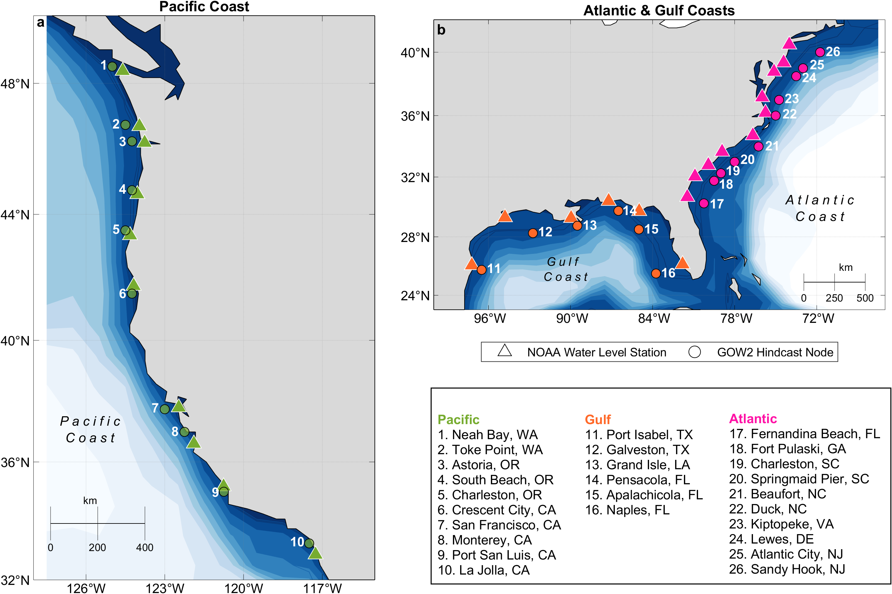

# Assessing Impact Hours on Sandy Beaches - Data Release
Data release to the manuscript "Rising Impact Hours on Sandy Beaches Linked to Total Water Level Variability along U.S. Coastlines".

The data provided in this repository are used to reproduce the figures in the manuscript and include: 

1) [Annual Impact Hours per Regime](impactHoursbyRegime) - data for Figures 2, 3, 4 and 5. This dataset contains annual total water level (TWL) impact hours in the Storm Impact Scale Regimes swash, collision, overtopping, and inundation, from 1980 through 2021, along the U.S. Pacific (from Neah Bay, WA, to La Jolla, CA), Gulf (from Port Isabel, TX, to Naples, FL) and Atlantic coastlines (from Sandy Hook, NJ, to Fernandina Beach, FL). Each station has an individual "hoursPerYear_allregimes_stationname.mat" file. This file contains a 8 x n matrix, where n is the number of years with at least ≥80% hourly completeness, from 1980 through 2021. Rows represent the following:
    - Row 1: average swash impact hours per year
    - Row 2: standard deviation of swash impact hours per year
    - Row 3: average collision impact hours per year
    - Row 4: standard deviation of collision impact hours per year
    - Row 5: average overtopping impact hours per year
    - Row 6: standard deviation of overtopping impact hours per year
    - Row 7: average inundation impact hours per year
    - Row 8: standard deviation of inundation impact hours per year
    
_Averages and standard deviations are computed across beach profiles located within the same 30 km-long coastal segment, as defined in the manuscript._

The folder also includes 'remainingYears_stationname.mat' files, which provide a vector listing the years with at least ≥80% hourly completeness for that station.

2) [Linear Trends in TWL Impact Hours](trendsSensSlope) - data for Figures 6 and 7. This dataset contains the Sen’s slope values and corresponding p-values for linear trends in TWL impact hours across the four Storm Impact Scale regimes swash, collision, overtopping, and inundation, from 1980 through 2021. The data are provided in a single Excel file 'trendsSensSlope.xlsx'. Columns represent the following:
   - ID: station ID number (matches the manuscript and map below)
   - location: station name and state abbreviation
   - swash: Sen’s slope for swash impact hours/year
   - collision: Sen’s slope for collision impact hours/year
   - overtopping: Sen’s slope for overtopping impact hours/year
   - inundation: Sen’s slope for inundation impact hours/year
   - pvalue swash: p-value for swash trend significance
   - pvalue collision: p-value for collision trend significance
   - pvalue overtop: p-value for overtopping trend significance
   - pvalue inundation: p-value for inundation trend significance

   _Trend calculations are based on annual impact hours averaged across beach profiles located within the same 30-km long coastal segment, as defined in the manuscript._

3) [Sensitivity Indices](sensitivityIndices) - data for Figure 8. This dataset provides local differential sensitivity indices (S_I) quantifying how changes in individual TWL driving processes influence annual TWL impact hours in the Storm Impact Scale regimes swash, collision, overtopping, and inundation regimes. For each input variable (i.e., relative sea level, seasonality, sea level anomalies, storm surge, significant wave height, peak wave period, and beach slope), we apply ±1 standard deviation perturbations to its full time series while holding all other variables constant, at their original value. Data are provided in individual files for each variable and perturbation direction (i.e., positive or negative/plus or minus): "<variable>_std_plus_diffSens_all.mat" and "<variable>_std_minus_diffSens_all.mat". These files contain a 26 x 4 matrix, where rows represent stations (row order below), and columns represent regimes in the following order swash (column 1), collision (column 2), overtopping (column 3), and inundation (column 4).

**Station order in files:**
   - Row 1: Fernandina Beach, FL
   - Row 2: Fort Pulaski, GA
   - Row 3: Charleston, SC
   - Row 4: Springmaid Pier, SC
   - Row 5: Duck, NC
   - Row 6: Beaufort, NC
   - Row 7: Kiptopeke, VA
   - Row 8: Lewes, DE
   - Row 9: Atlantic City, NJ
   - Row 10: Sandy Hook, NJ
   - Row 11: Naples, FL
   - Row 12: Pensacola, FL
   - Row 13: Apalachicola, FL
   - Row 14: Grand Isle, LA
   - Row 15: Galveston, TX
   - Row 16: Port Isabel, TX
   - Row 17: Neah Bay, WA
   - Row 18: Toke Point, WA
   - Row 19: Astoria, OR
   - Row 20: South Beach, OR
   - Row 21: Charleston, OR
   - Row 22: Crescent City, CA
   - Row 23: San Francisco, CA
   - Row 24: Monterey, CA
   - Row 25: Port San Luis, CA
   - Row 26: La Jolla, CA

 <figure>
  
  <figcaption><em>Map of locations of the water level stations (triangles) and wave hindcast nodes (circles). The colors represent the U.S. coastlines, with the Pacific coast as green (a), the Gulf coast as orange, and the Atlantic coast as pink (b). Locations are numbered from 1–10 on the Pacific, 11–16 on the Gulf, and 17–26 on the Atlantic coast, with station names listed in the legend.</em></figcaption>
</figure>

